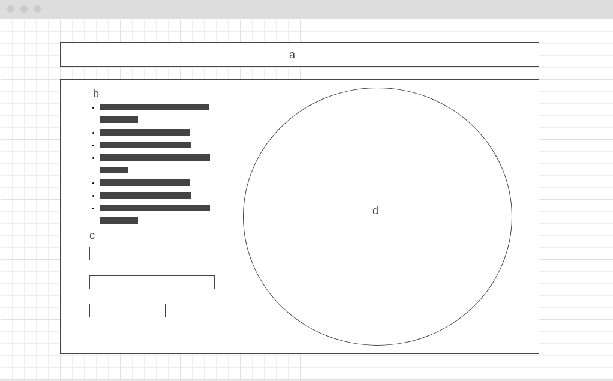

# Endangered Species

## Overview
This data reflects the locations and information regarding world's endangered wild animals which mainly caused by human activities.

## Functionality & MVP
User can do below with this app:
* See a world map which would show locations when a checkbox for certain wild animal is checked.
* Show endangered wilds' locations on the map by continents when a continent on map or continent checkbox is selected.
* When one or more species is selected, show the top 3 reasons causing this species being endangered in a chart.

## Data & APIs
This app retrieve data from IUCN Red List API - v3.

## Wireframe

This is a one page app including:
- a. Topic
- b. Species checkboxes
- c. Top 3 causes in percentage
- d. rotating world map

## Design
An earth with rotating animation. User can click on continents on it to select it; click again to cancel the selection. Would show all the locations on selected continents only. If no continent is selected, would show all. When users click on the checkbox of a species, the locations of them would show on the earth.

## Architecture & Technologies
* HTML5, CSS3
* Vanilla JavaScript
* D3.js
* Webpack

## Timeline
- Day 1: Setup webpack and webpack.config.js. Create basic entry file and skeleton of classes that I may need.
- Day 2: Rotating earth animation and styling.
- Day 3: Setup basic html skeleton, retrieve API data.
- Day 4: Finish styling and add github and linkedin links.

## Upcoming Features
- Users can click on the globe and spin it as they want.
- Typewriter animation on the topic.